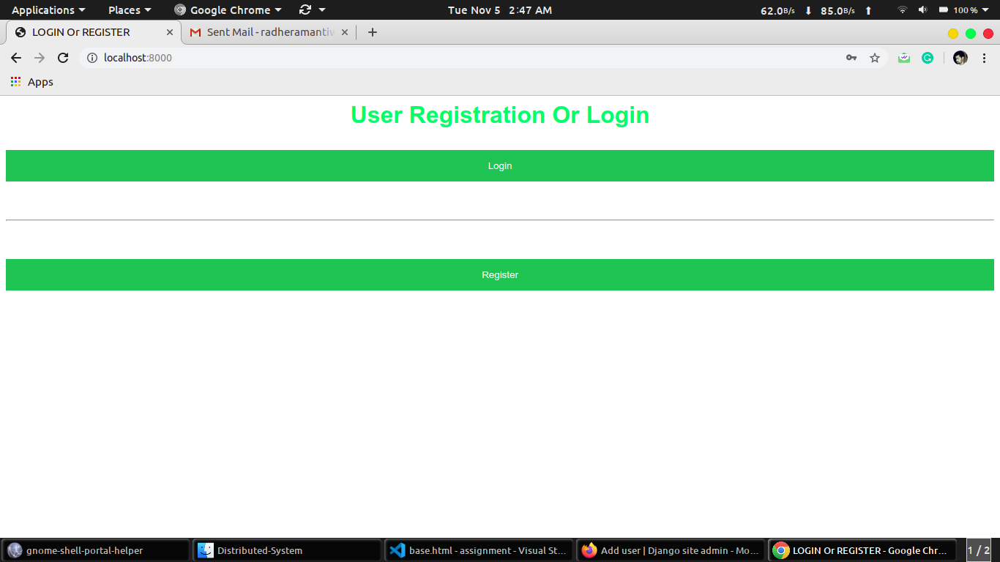
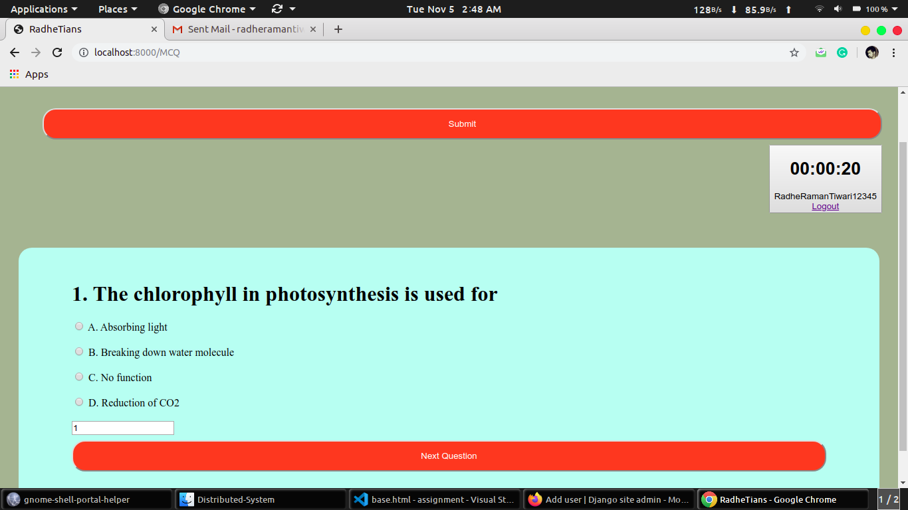
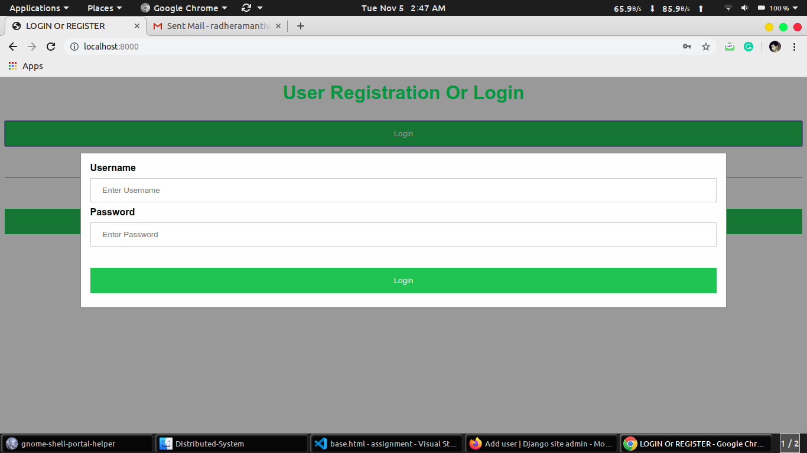
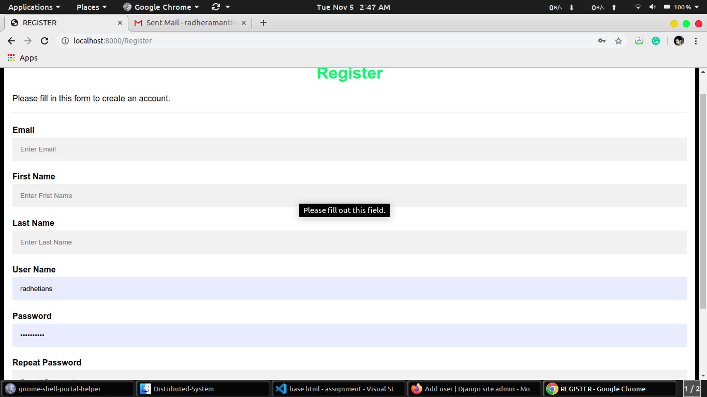
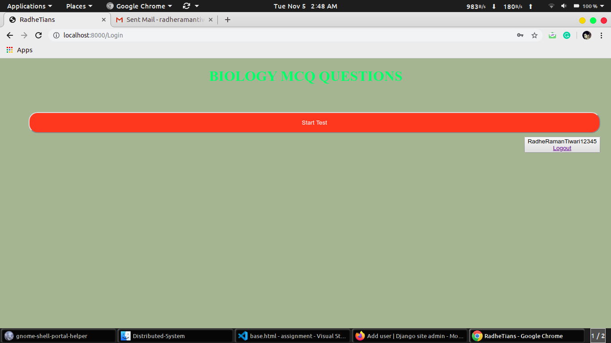
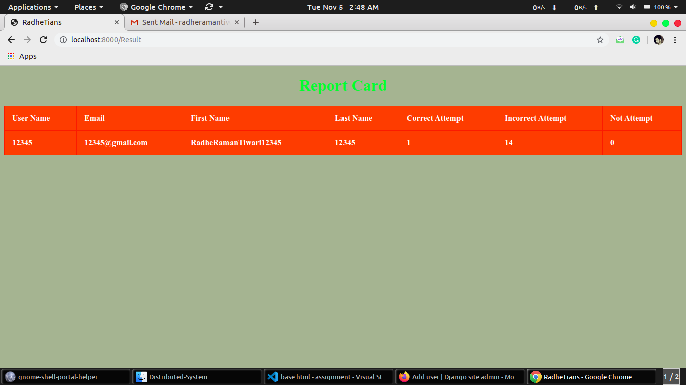
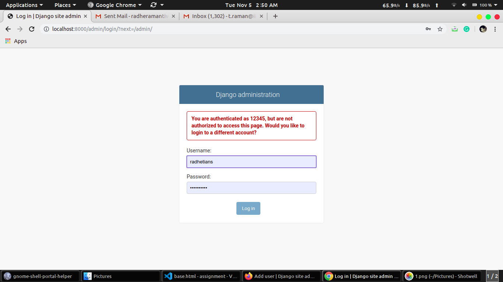
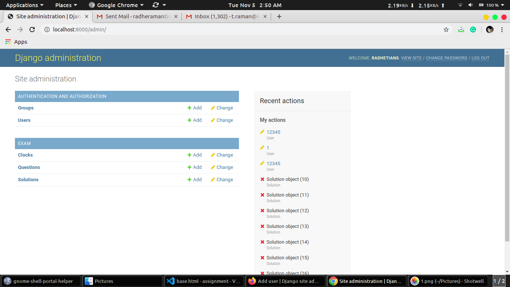
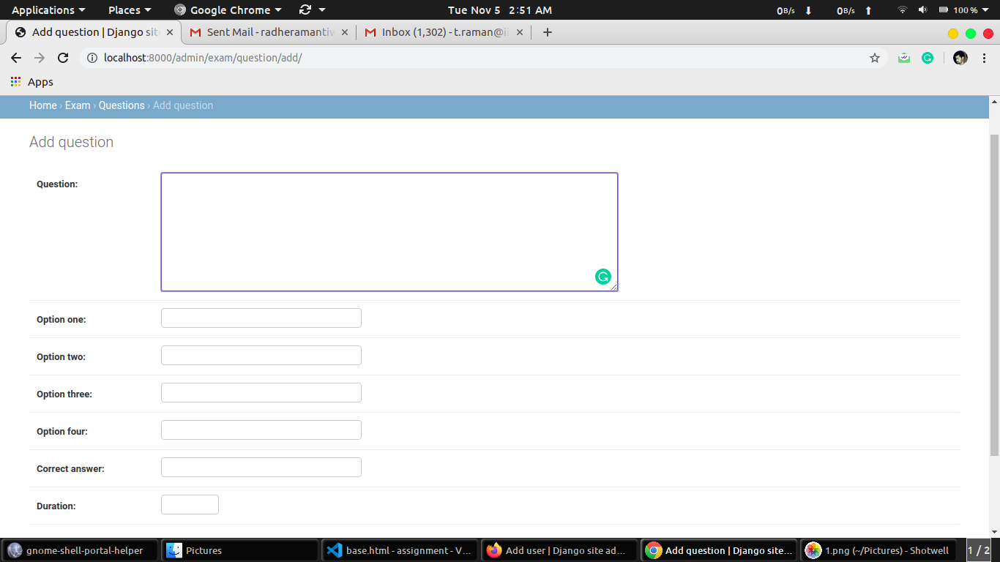

# Online Multiple Choice Questions(MCQ) Quiz Portal

   A Python Django web application for taking MCQ (Multiple choice questions) online Quiz Tests.

# About

This application is developed in Python Django (a web framework for rapid development). The beauty of this project is that user can stop quiz at any during the period of quiz exam. The  A user can sign in with any of the one roles "Admin" or "Normal User". This Web Application presents a set of random questions from database to user and calculates user score accordingly.

  

  

# Add Features

1. Added the feature that Admin can stop any user at any time during the eaxm period.

2. Added Timer support for each inividual question.
 
3. Added control to "Enable" and "Disable" the quiz on the Admin panel by Global Clock.

4. Added control to navigate among all the questions of quiz (during the quiz) and finish the quiz whenever the user wants.

5. Added control so that user can start the quiz at any time and continue the quiz even if some error or session timeout occurs.

6. Added control to store the answers to question and show a detailed analysis of the quiz results.

7. Improved GUI of the quiz panel.

# How to Use

1. Use the Admin Panel to set up quiz questions. Quiz won't be enabled unless you click the "Start Test" button. Click on the same to start an added quiz.

2. Scores are updated realtime on the server, however the result will be shown only when the user finishes the quiz, or there is a time out or the admin ends the quiz by clicking on "is_staff" attribute of Normal User.

3. Once the admin clicks on the individual user "is_staff" attribute, the quiz ends for that particular user taking that quiz. 

4. Once the quiz is disabled for that particular user, the quiz becomes inaccessible for that user. If the quiz is enabled again for that particular user by Admin then, user will be able to start quiz.

5. All the questions in quiz exam will come with individual time depands upon difficulty of question(i.e 20sec, 40sec, 600sec, etc).

6. User can skill questions during quiz exam period.

7. There is one text field where user can go to any question from any question to some any question.

## USAGE
   
   Python3, Django, Postgresql, psycopg2.
   
## REQUIREMENT
 
### Environment:
  
   Source code to this project is coded in Python3, with its GUI running in Django framework.
 
 
### Packages:

   pip3, os, postgres, psycopg2.

### Command Line Interface(CLI):
  
   Terminal.
 
 
## INSTALLATION 
 
   Use the package manager [pip](https://pip.pypa.io/en/stable/) to install packages subprocess, os and set env for Python3.
 
### Packages :  

	$ pip install virtualenv
   	$ pip install subprocess
   	$ pip install os 

 
### Python3 env :

   	$ pip install python3.7 python-pip

### Setting up Django framework for Python3 :

   	$ pip install Django

   Installing Django from https://docs.djangoproject.com/en/2.2/intro/install/

## Postgres Install :

### Install PostgreSQL on Ubuntu :

	$ sudo apt-get update
	$ sudo apt-get install postgresql postgresql-contrib

To connect with PostgreSQL.
	
	$ sudo su - postgres
	$ psql
	$ postgres-# \conninfo

And create database name called "exam"

	$ postgres-# create database exam
	$ \l

### Install PostgreSQL on Window :

	To insatll on Window go throught this [postgres](https://www.enterprisedb.com/downloads/postgres-postgresql-downloads).

### Install PostgreSQL connect to Python :
	
	$ pip install psycopg2

### Clone repository :

	https://github.com/RadheTians/MCQ-Quiz-System.git
	cd MCQ-System-System

### Migrations :

To run migrations.

	$ python manage.py makemigrations
	$ python manage.py migrate

### Create superuser :

To create super user run.

	$ python manage.py createsuperuser

After running this command it will ask for username, password. You can access admin panel from (localhost:8000/admin/)

## Running locally :
 
To run at localhost. It will run on port 8000 by default.

	$ python manage.py runserver

To access this project go to any browser and type in url (localhost:8000)

  

  

  

  

  

  

  

